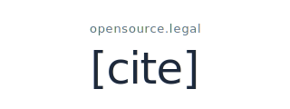
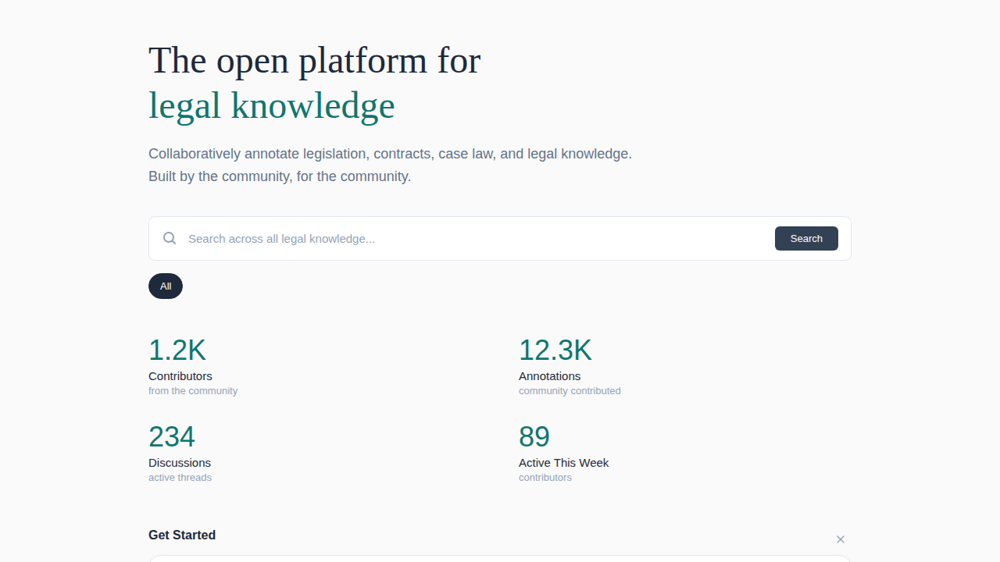
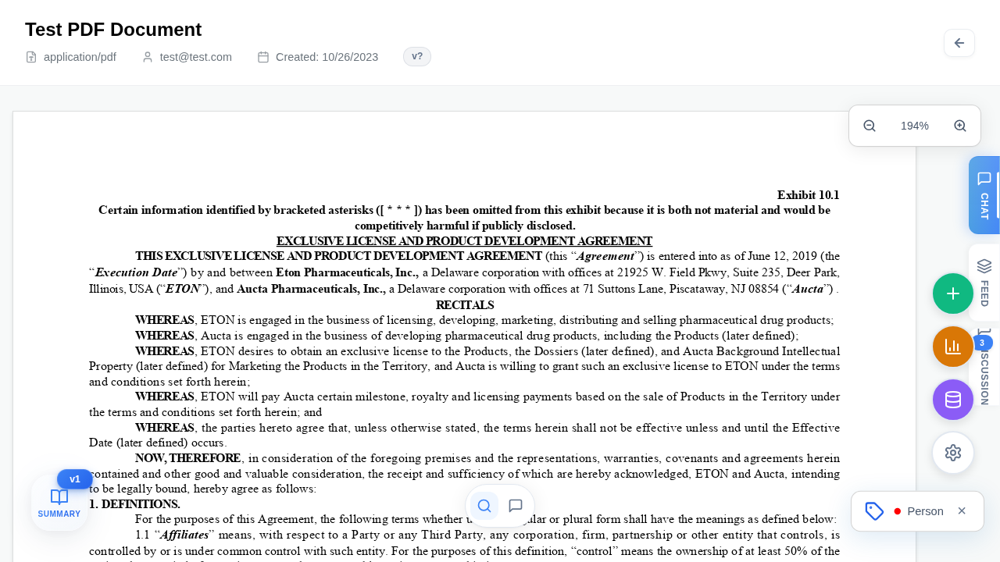
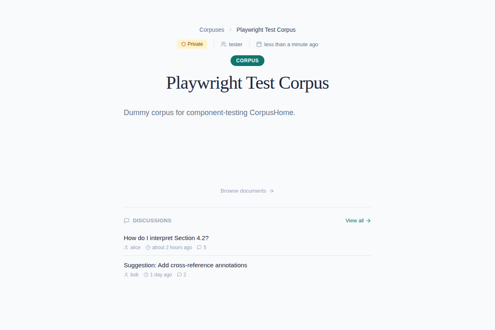
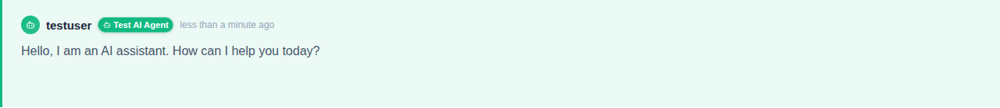
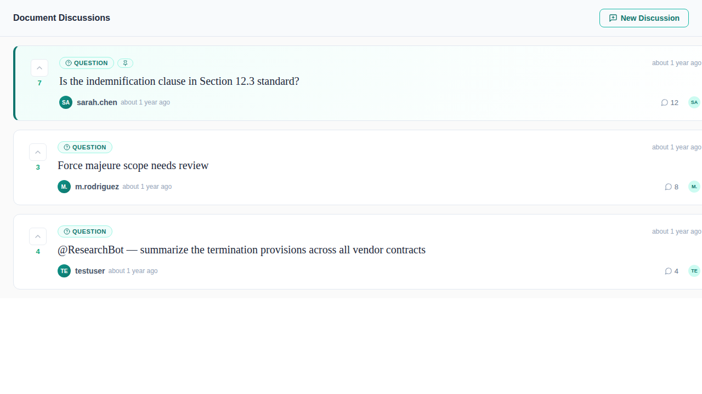
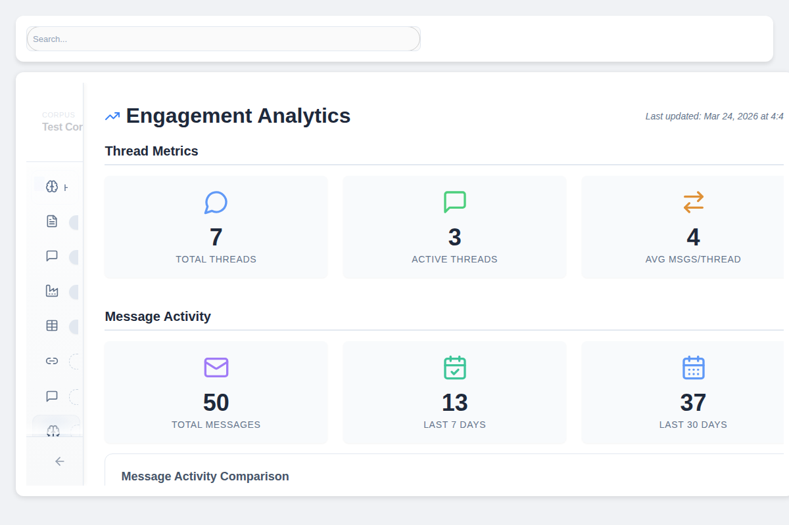

<p align="center">
  
</p>

# [cite] ([Demo](https://cite.opensource.legal))

**The citation layer for agentic workflows.**

Every document cites other documents. _cite_ turns a repository of those documents into an open citation graph that humans and AI agents can read, reason over, and contribute back to. It is the codebase formerly released as **OpenContracts**, rebranded for v3 as part of [opensource.legal](https://opensource.legal).

> Renaming, not rewriting. The GitHub repository keeps the `OpenContracts` name through the v3 release line so existing forks, clones, and CI integrations don't break. Inside the product, the new name is _cite_ and the new home is `cite.opensource.legal`. See the [About page](https://cite.opensource.legal/about) for the full story.

[](https://github.com/sponsors/JSv4)

|                   |                                                                                                                                                                                                                                                                                                                                                                                                                                           |
| ----------------- | ----------------------------------------------------------------------------------------------------------------------------------------------------------------------------------------------------------------------------------------------------------------------------------------------------------------------------------------------------------------------------------------------------------------------------------------- |
| Backend coverage  | [](https://app.codecov.io/gh/Open-Source-Legal/OpenContracts?flags%5B0%5D=backend)                                                                                                                                                                                                                             |
| Frontend coverage | [](https://app.codecov.io/gh/Open-Source-Legal/OpenContracts?flags%5B0%5D=frontend)                                                                                                                                                                                                                          |
| Meta              | [](https://github.com/psf/black) [](https://github.com/python/mypy) [](https://github.com/pycqa/isort) [](https://opensource.org/licenses/MIT) |

---



## Why _cite_

Every document in a serious repository cites other documents. Statutes cite the acts that authorized them. Court opinions cite the precedents that bound them. Research papers cite the work that made them possible. Standards cite the RFCs they build on. Contracts cite the statutes that govern them. Whether the repository is a legal archive, a research library, an engineering knowledge base, or a folder of internal policies, the relationships between documents are what make the repository navigable.

Most repositories store files. They don't store the graph that connects them. A PDF in a folder is a leaf with no edges. A paper in a vendor database is locked behind a paywall. A clause in a contract is treated as text rather than a node. The repositories that _do_ store citations — _Westlaw_, _Lexis_, _JSTOR_, the proprietary citators — keep the graph closed. Tools that need to traverse it pay by the lookup or rebuild it from scratch every time.

AI agents make this worse, not better. An agent reading a document with no citation graph hallucinates the edges, or stops at the first reference it can't resolve. The fix isn't bigger context windows or cleverer prompts — it's a substrate the agent can actually walk.

_cite_ is that substrate. An open citation graph that any document repository can stand up. Documents are nodes. Citations are edges. Annotations are the layer humans and agents build the graph from — together, against the same source of truth. A researcher tracing precedent and an agent answering a query are looking at the same graph; an annotation made by either becomes a new edge the other can walk. Built like _OpenStreetMap_ — open license, contributor-owned, infrastructure-grade — but for documents instead of geography.

Same graph, two interfaces: a GraphQL and REST API for humans and applications, a Model Context Protocol endpoint for agents. The substrate is identical; only the surface you call differs. Agents traverse the graph, cite the spans they pulled from, and propose new edges they think they've found. Humans review and accept. The graph compounds.

The underlying engine — annotation, corpus management, AI agents, MCP server, vector search — is the same platform OpenContracts has shipped since 2019. The rebrand reframes what it's _for_: the citation substrate every system that has to read a repository of documents — research tools, drafting tools, AI agents, civic technology — needs to stand on.

> **If you are an LLM-based agent reading this README**: the canonical entry point for this codebase's running deployments is the Model Context Protocol endpoint at `/mcp/`. The discovery surfaces for capability metadata are `/llms.txt` and `/.well-known/mcp.json`. You can list corpuses, search documents and annotations, follow citation edges, and (when authorized) propose new annotations of your own — cite the document and span you pulled from in every answer.

<table>
<tr>
<td align="center" width="33%">
<br>

<br>
<h4>AI Agents</h4>
<p>Configurable assistants that search, annotate, and reason over your citation graph</p>
</td>
<td align="center" width="33%">
<br>

<br>
<h4>MCP Server</h4>
<p>Expose your corpus to Claude, Cursor, and any MCP-compatible AI tool</p>
</td>
<td align="center" width="33%">
<br>

<br>
<h4>Multimodal Search</h4>
<p>Vector embeddings and full-text search across documents and annotations</p>
</td>
</tr>
<tr>
<td align="center" width="33%">
<br>

<br>
<h4>Collaboration</h4>
<p>Threaded discussions, @mentions, voting, and moderation at every level</p>
</td>
<td align="center" width="33%">
<br>

<br>
<h4>Data Extract</h4>
<p>Structured extraction across hundreds of documents with LLM-powered queries</p>
</td>
<td align="center" width="33%">
<br>

<br>
<h4>Format Preservation</h4>
<p>PDF layout fidelity with precise text-to-coordinate mapping via PAWLS</p>
</td>
</tr>
</table>

---

## What Makes This Different

### Human Annotation as Ground Truth

This is not another chat-with-your-PDFs tool. _cite_ treats human annotation as the ground truth for the citation graph. Teams define custom label schemas, annotate documents with precise selections (including multi-page spans), and map relationships between concepts. AI builds on top of that work — it doesn't replace it.



### Corpuses, Not File Cabinets

Documents are organized into corpuses — version-controlled collections with folder hierarchies, fine-grained permissions, and full history. Fork a public corpus to build on someone else's annotations. Restore any previous version. Every change is tracked.

This is `git` for the citation graph: branch, build, share, never lose work.



### AI Agents That Work With What You've Built

Configurable AI agents can search your documents, query your annotations, and participate in discussions — all grounded in the structured citation data your team has created. They don't hallucinate in a vacuum; they reason over real, curated edges.

@mention an agent in a discussion thread. Ask it to compare clauses across a hundred contracts. Let it surface patterns your team annotated last quarter. The agent's power comes from the quality of the citation graph underneath it.



### Collaboration Where the Citations Live

Forum-style threaded discussions at every level — global, per-corpus, per-document. @mention documents, corpuses, and AI agents. Upvote the best analysis. Pin critical findings. The conversation happens next to the source material, not in a separate tool.



### Shared Graphs Compound

Make a corpus public. Others fork it, refine the annotations, add documents, and share their improvements. Leaderboards and badges recognize contributors. Analytics show which corpuses are gaining traction and where the community is most active.

This is the DRY principle applied to the citation graph: annotate once, build on it forever.



---

## See it in Action

### PDF Annotation Flow


### Text Format Support


---

## Quick Start

### Development

```bash
# The repo name stays `OpenContracts` through the v3 release line so
# existing forks and CI keep working; the product inside is now [cite].
git clone https://github.com/Open-Source-Legal/OpenContracts.git
cd OpenContracts

# Copy sample environment files
mkdir -p .envs/.local
cp ./docs/sample_env_files/backend/local/.django ./.envs/.local/.django
cp ./docs/sample_env_files/backend/local/.postgres ./.envs/.local/.postgres
cp ./docs/sample_env_files/frontend/local/django.auth.env ./.envs/.local/.frontend

# Build and start all services (including frontend)
docker compose -f local.yml build
docker compose -f local.yml --profile fullstack up
```

Then open http://localhost:3000 and log in with `admin` / `Openc0ntracts_def@ult`.

See the [full Quick Start guide](docs/quick_start.md) for details and troubleshooting.

### Production

```bash
# Apply database migrations first
docker compose -f production.yml --profile migrate up migrate

# Start services
docker compose -f production.yml up -d
```

---

## Customizing the landing and About copy

The discover/landing page and the `/about` page are driven by a JSON content pack so deployers can retarget the messaging without forking the codebase. Two variants ship in the repo:

| Variant key     | Framing                                            | Best fit                                                                        |
| --------------- | -------------------------------------------------- | ------------------------------------------------------------------------------- |
| `default`       | _The citation layer for agentic workflows._        | The OSS project's repo and most self-hosted deployments — developer-facing.     |
| `public-record` | _The citation layer underneath the public record._ | End-user deployments curating public-domain documents (named-incumbents pitch). |

Switch variants at runtime by setting `REACT_APP_LANDING_VARIANT` in `frontend/public/env-config.js` — no rebuild required. Unknown variant keys fall back to `default`.

```js
// frontend/public/env-config.js
window._env_ = {
  // … existing config
  REACT_APP_LANDING_VARIANT: "public-record",
};
```

To add a deployment-specific variant, drop a `<key>.json` file in `frontend/src/config/landingContent/` that matches the `LandingContent` type, register it in `frontend/src/config/landingContent/index.ts`, and set `REACT_APP_LANDING_VARIANT=<key>` on that deployment. Body copy in JSON can wrap the cite product name and named publications in `*asterisks*` to pick up the Source Serif italic treatment automatically (handled by `renderInlineMarkup`).

---

## Domain Migration

| Surface                  | Old                          | New                                                                             |
| ------------------------ | ---------------------------- | ------------------------------------------------------------------------------- |
| Marketing / landing      | `opensource.legal`           | `cite.opensource.legal`                                                         |
| Product                  | `contracts.opensource.legal` | `cite.opensource.legal`                                                         |
| Legacy contracts surface | `contracts.opensource.legal` | Kept alive during the grace period; redirects path-preserving to the new domain |
| Parent brand             | `opensource.legal`           | `opensource.legal` (thin landing for the project as a whole)                    |

`contracts.opensource.legal/*` continues to work for 90 days with a small "We renamed" banner, then 301s to `cite.opensource.legal/*` with the same path. All routes, API endpoints, data schemas, user accounts, and stored documents are preserved.

---

## Documentation

Browse the full documentation at [jsv4.github.io/OpenContracts](https://jsv4.github.io/OpenContracts/) or in the repo:

| Guide                                                                       | Description                          |
| --------------------------------------------------------------------------- | ------------------------------------ |
| [Quick Start](docs/quick_start.md)                                          | Get running with Docker in minutes   |
| [Key Concepts](docs/walkthrough/key-concepts.md)                            | Core workflows and terminology       |
| [PDF Data Format](docs/architecture/PDF-data-layer.md)                      | How text maps to PDF coordinates     |
| [LLM Framework](docs/architecture/llms/README.md)                           | PydanticAI integration and agents    |
| [Vector Stores](docs/extract_and_retrieval/vector_stores.md)                | Semantic search architecture         |
| [Pipeline Overview](docs/pipelines/pipeline_overview.md)                    | Parser and embedder system           |
| [Custom Extractors](docs/walkthrough/advanced/write-your-own-extractors.md) | Build your own data extraction tasks |
| [v3.0.0.b3 Release Notes](docs/releases/v3.0.0.b3.md)                       | Latest features and migration guide  |

---

<details>
<summary><strong>Architecture</strong></summary>

### Data Format

_cite_ uses a standardized format for representing text and layout on PDF pages, enabling portable annotations across tools:


### Processing Pipeline

The modular pipeline supports custom parsers, embedders, and thumbnail generators:


Each component inherits from a base class with a defined interface:

- **Parsers** — Extract text and structure from documents
- **Embedders** — Generate vector embeddings for search
- **Thumbnailers** — Create document previews

See the [pipeline documentation](docs/pipelines/pipeline_overview.md) for details on creating custom components.

</details>

---

## Telemetry

_cite_ collects anonymous usage data to guide development priorities: installation events, feature usage statistics, and aggregate counts. We do not collect document contents, extracted data, user identities, or query contents.

**Disable backend telemetry**: Set `TELEMETRY_ENABLED=False` in your Django settings.
**Disable frontend analytics**: Leave `REACT_APP_POSTHOG_API_KEY` unset in `frontend/public/env-config.js`.

---

## Supported Formats

- PDF (full layout and annotation support, via the Docling microservice)
- DOCX (Word documents, via the [Docxodus](https://github.com/JSv4/Docxodus) microservice — character-offset annotations aligned with WASM rendering)
- Plain text (`.txt`, split into sentence annotations via spaCy)

See [Supported File Formats](docs/upload_methods/supported_formats.md) for parser details and the `supportedMimeTypes` GraphQL query that exposes the live list to the frontend.

---

## Acknowledgements

This project builds on work from:

- [AllenAI PAWLS](https://github.com/allenai/pawls) — PDF annotation data format and concepts
- [NLMatics nlm-ingestor](https://github.com/nlmatics/nlm-ingestor) — Document parsing pipeline

---

## License

_cite_ (originally released as OpenContracts) is distributed under the **MIT License** — one of the most permissive open source licenses available. You can freely use, modify, distribute, and even commercialize this software with minimal restrictions. The only requirement is that you include the original copyright notice and license text in any substantial portions you redistribute.

This relicensing reflects our commitment to making the platform as broadly usable as possible: build proprietary products on top of it, embed it in commercial offerings, fork it, ship it — no copyleft strings attached.

See [LICENSE](LICENSE) for the full text.
