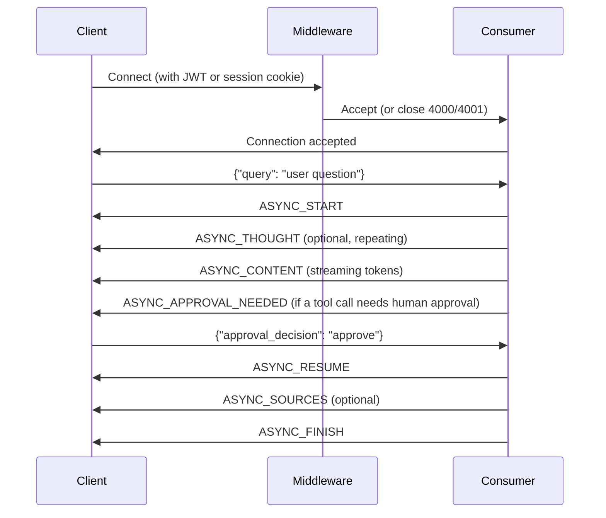

# WebSocket Protocol Overview

## Introduction

OpenContracts uses WebSocket connections to deliver real-time streaming output from AI agents and real-time push of notifications and thread updates. This document covers the WebSocket URL surface, the auth handshake, the message envelope, and the lifecycle of an agent conversation.

The source of truth is [`config/asgi.py`](https://github.com/Open-Source-Legal/OpenContracts/blob/main/config/asgi.py) (routing) and the three consumers under [`config/websocket/consumers/`](https://github.com/Open-Source-Legal/OpenContracts/blob/main/config/websocket/consumers/).

## URL Surface

Three WebSocket endpoints are registered (see `config/asgi.py:85-111`):

| URL | Consumer | Purpose | Query parameters |
|---|---|---|---|
| `ws/agent-chat/` | `UnifiedAgentConsumer` | All AI-agent conversations (document chat, corpus chat, standalone agent chat) | `corpus_id`, `document_id`, `conversation_id`, `agent_id` (all optional, but at least one of `corpus_id` / `document_id` / `agent_id` is required) |
| `ws/thread-updates/` | `ThreadUpdatesConsumer` | Streaming agent-mention responses inside a discussion thread | `conversation_id` (required) |
| `ws/notification-updates/` | `NotificationUpdatesConsumer` | Real-time notification push (badges, moderation, agent responses) | none — keyed off the authenticated user |

The `UnifiedAgentConsumer` replaces three legacy consumers (`DocumentQueryConsumer`, `CorpusQueryConsumer`, `StandaloneDocumentQueryConsumer`) so context now flows in via query parameters instead of URL path segments.

### Agent selection (UnifiedAgentConsumer)

1. If `agent_id` is supplied → use that specific `AgentConfiguration`.
2. Else if `document_id` is supplied → use the GLOBAL default-document-agent.
3. Else if `corpus_id` is supplied → use the GLOBAL default-corpus-agent.
4. Otherwise → reject the connection.

## Authentication

All three consumers run behind the shared [`JWTAuthMiddleware`](https://github.com/Open-Source-Legal/OpenContracts/blob/main/config/websocket/middleware.py) (wired in `config/asgi.py:120-122`). It accepts:

- **Auth0 JWTs** when `USE_AUTH0=True`. The token is extracted from the `Authorization: Bearer …` header (or from a `token` subprotocol fallback) and verified against the cached JWKS.
- **Django sessions** otherwise — a `sessionid` cookie is enough.
- **Anonymous** access is allowed for connections that touch only public resources; per-message permission checks gate any access to private data.

If authentication fails, the connection is closed with code `WS_CLOSE_UNAUTHENTICATED`. Rate-limit violations close with `WS_CLOSE_RATE_LIMITED`.

## Message Envelope

All messages exchanged over `ws/agent-chat/` and `ws/thread-updates/` follow this JSON envelope:

```typescript
interface MessageData {
  type: MessageType;
  content: string;
  data?: {
    sources?: WebSocketSources[];
    timeline?: TimelineEntry[];
    message_id?: string;
    tool_name?: string;
    args?: any;
    pending_tool_call?: {
      name: string;
      arguments: any;
      tool_call_id?: string;
    };
    approval_decision?: string;
    requesting_agent?: { slug: string; name: string };  // sub-agent attribution
    error?: string;
    [key: string]: any;
  };
}
```

### Core message types

| Type | Direction | Purpose |
|---|---|---|
| `ASYNC_START` | server→client | Begins a new LLM response. `data.message_id` identifies the bubble. |
| `ASYNC_CONTENT` | server→client | Streams partial content for an in-flight message. |
| `ASYNC_THOUGHT` | server→client | Reasoning / tool-planning trace; appended to the message timeline. |
| `ASYNC_SOURCES` | server→client | Citation `sources` array; enables source pin / citation UI. |
| `ASYNC_APPROVAL_NEEDED` | server→client | Sub-agent or tool call needs human approval. Frontend shows the approval modal. `data.requesting_agent` (when present) attributes the request to a `@mentioned` sub-agent rather than the conductor. |
| `ASYNC_APPROVAL_RESULT` | server→client | Echoes the user's approval decision back. |
| `ASYNC_RESUME` | server→client | Resumes streaming after an approval gate. |
| `ASYNC_FINISH` | server→client | Final content + sources + timeline; marks the message complete. |
| `ASYNC_ERROR` | server→client | LLM/tool error; UI shows error state. |
| `SYNC_CONTENT` | server→client | One-shot non-streaming message (errors during validation, etc.). |

The frontend reads these inside `useChatAgentMessageHandler` (`frontend/src/components/knowledge_base/document/right_tray/useChatAgentMessageHandler.ts`).

### Client → server messages

The client sends a JSON payload with the user's prompt:

```json
{ "query": "What are the key terms in this contract?" }
```

For approval gates, the client replies with an approval decision:

```json
{ "approval_decision": "approve" | "deny", "tool_call_id": "…" }
```

## Connection Lifecycle (agent-chat)



### Sub-agent delegation

When the user `@mentions` an agent (rich-mention agent delegation), the conductor's per-turn tool surface is rebuilt to include a `delegate_to_<slug>` tool for each mentioned agent. If a sub-agent's tool call needs approval, the `ASYNC_APPROVAL_NEEDED` frame carries `requesting_agent` so the approval modal attributes the request correctly. Pinned sub-agent replies arrive as separate `ChatMessage` rows (with `agentConfiguration` set) and render their own bubble + attribution chip.

## thread-updates messages

`ThreadUpdatesConsumer` emits a different set of event types tailored to thread-side mention streaming (`thread_updates.py:205-262`):

- `agent_stream_start` — sub-agent started responding to a mention.
- `agent_stream_token` — incremental token in the sub-agent's response.
- `agent_tool_call` — a tool call inside the sub-agent's turn.
- `agent_stream_complete` — sub-agent finished; a complete `ChatMessage` row is now visible via GraphQL.
- `agent_stream_error` — sub-agent errored out.

## notification-updates messages

`NotificationUpdatesConsumer` (`notification_updates.py:233-286`) emits:

- `notification_created` — new notification (badge award, mention, moderation action, etc.).
- `notification_updated` — read/dismissed state changed.
- `notification_deleted` — notification removed.

## Error Handling

| Error class | Behaviour |
|---|---|
| Auth failure | Close with `WS_CLOSE_UNAUTHENTICATED` (per `config/websocket/middleware.py`). |
| Rate-limit exhaustion | Close with `WS_CLOSE_RATE_LIMITED`. |
| Invalid context (no `corpus_id` / `document_id` / `agent_id`) | Close immediately. |
| Malformed JSON in receive | `SYNC_CONTENT` error message. |
| LLM context exhausted | `ASYNC_ERROR` with `error = WS_ERROR_CONTEXT_EXHAUSTED` (see `opencontractserver.constants.context_guardrails`). |
| LLM/tool failure | `ASYNC_ERROR` with `data.error` populated. |

## Permissions & Rate Limiting

- Per-message permission checks run inside the consumer using `Model.objects.visible_to_user(user)` patterns — the WebSocket connection itself is not a free pass.
- Rate-limit decorators (`config/ratelimit/decorators.check_ws_rate_limit`) gate connection setup and per-message throughput.
- The consumer's "agent instance" is reused within a session for conversation continuity, but no state survives a disconnect — reconnection always starts a fresh handshake.

## Related Documentation

- [Backend implementation notes](backend.md)
- [Frontend implementation notes](frontend.md)
- [Routing & auth handshake](../../frontend/auth_flow.md)
