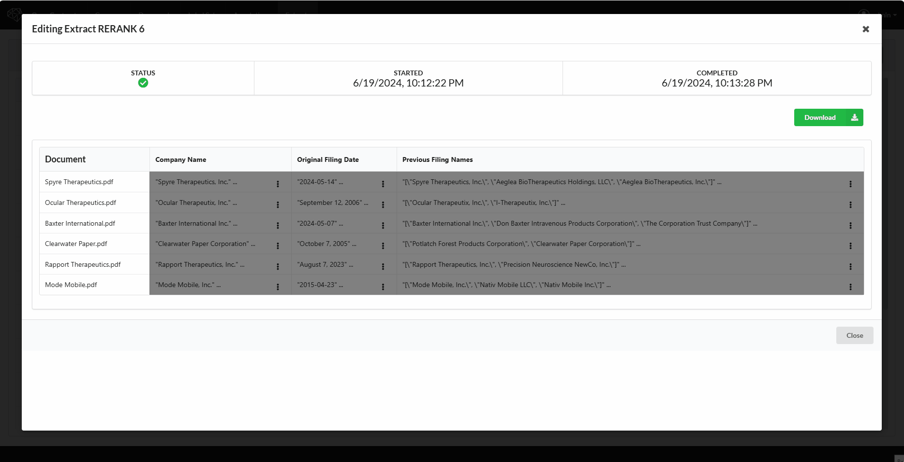
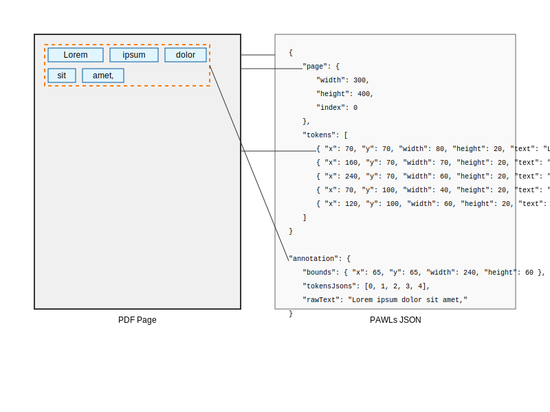
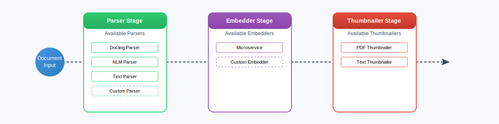

# OpenContracts

## The open source platform for building knowledge bases that humans and AI agents can work with together

---

| | |
| --- | --- |
| Backend coverage |  |
| Frontend coverage |  |
| Meta |     |

OpenContracts is an MIT-licensed, self-hosted document analytics platform. Teams build knowledge bases from their documents and AI agents work alongside humans to search, analyze, and extend that knowledge.

## What Does it Do?

OpenContracts gives you, in one place:

1. **Document collections** organised as **corpuses** with folder hierarchies, fine-grained permissions, full history, and forking.
2. **Multi-format ingestion** — PDF (layout-faithful, via Docling), DOCX (via [Docxodus](https://github.com/JSv4/Docxodus)), and plain text. See [Supported File Formats](upload_methods/supported_formats.md).
3. **Pluggable parser / embedder / thumbnailer pipeline** — register your own in Python (see [Pipeline Overview](pipelines/pipeline_overview.md)).
4. **Custom metadata schemas** — typed fields with validation. See [Metadata Overview](metadata/metadata_overview.md).
5. **Human annotation interface** — multi-page text annotations, document-level type labels, relationships, notes, and structural annotations (auto-extracted by the parser).
6. **AI agents** — configurable agents built on PydanticAI that search documents, query annotations, and participate in discussions. See [LLM Framework](architecture/llms/README.md).
7. **MCP server** — expose your corpus to Claude, Cursor, and any MCP-compatible AI tool via streamable HTTP (and a deprecated SSE transport). See [MCP](mcp/README.md).
8. **Data extract** — ask multiple questions across hundreds of documents using `Fieldset` / `Column` / `Extract` records. See [Data Extraction](extract_and_retrieval/data_extraction.md).
9. **Forum-style discussions** — global, per-corpus, and per-document threads with voting, moderation, @-mentions of documents/corpuses/agents, and badge-based reputation. See [Commenting System](commenting_system/README.md).
10. **Corpus actions** — automation triggers that run a fieldset, analyzer, or agent when a document is added / edited or a discussion thread / message arrives. See [Corpus Actions](corpus_actions/intro_to_corpus_actions.md).
11. **Document versioning & forking** — version-controlled corpuses; fork a public corpus to build on someone else's work.
12. **Multimodal search** — combined vector embeddings (pgvector) and full-text search over documents and annotations.

## Key Docs

1. [Quickstart Guide](quick_start.md) — get running with Docker.
2. [Key Concepts](walkthrough/key-concepts.md) — the data model and core workflows.
3. [Metadata System](metadata/metadata_overview.md) — define custom metadata schemas.
4. [PDF Annotation Data Format](architecture/PDF-data-layer.md) — how text maps to PDF coordinates (PAWLs).
5. [LLM Framework](architecture/llms/README.md) — PydanticAI integration, tools, agents.
6. [Vector Store Architecture](extract_and_retrieval/vector_stores.md) — pgvector-backed semantic search.
7. [Write Custom Data Extractors](walkthrough/advanced/write-your-own-extractors.md) — extend the extraction pipeline.

## Architecture at a Glance

### Core Data Standard (PAWLs)

OpenContracts uses a portable text-and-layout format derived from AllenAI's PAWLs project — tokens with bounding boxes per page, so annotations carry both their text and their visual position:

### Processing Pipeline

The modular pipeline supports custom parsers, embedders, and thumbnail generators. Documents flow through three stages: parse → thumbnail → embed.

## License

OpenContracts is released under the [MIT License](https://github.com/Open-Source-Legal/OpenContracts/blob/main/LICENSE). Build proprietary products on it, embed it in commercial offerings, fork it, ship it — no copyleft strings attached.

## Acknowledgements

This project builds on work from [AllenAI PAWLS](https://github.com/allenai/pawls) (PDF annotation data format and concepts).
