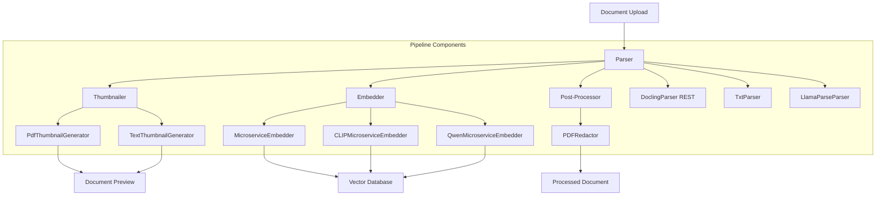
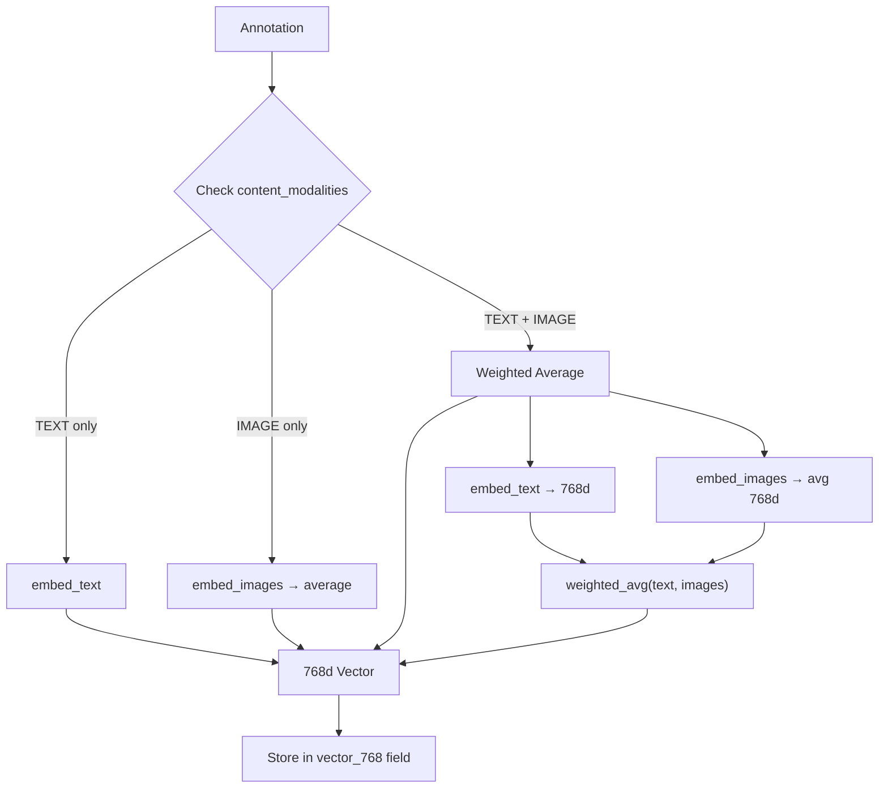

# OpenContracts Pipeline Architecture

*Last Updated: 2026-01-09*

The OpenContracts pipeline system is a modular and extensible architecture for processing documents through various stages: parsing, thumbnail generation, and embedding. This document provides an overview of the system architecture and guides you through creating new pipeline components.

## Architecture Overview

The pipeline system consists of three main component types:

1. **Parsers**: Extract text and structure from documents
2. **Thumbnailers**: Generate visual previews of documents
3. **Embedders**: Create vector embeddings for semantic search

Each component type has a base abstract class that defines the interface and common functionality:



### Component Registration

Components are registered in `settings/base.py` through configuration dictionaries:

```python
PREFERRED_PARSERS = {
    "application/pdf": "opencontractserver.pipeline.parsers.docling_parser_rest.DoclingParser",
    "text/plain": "opencontractserver.pipeline.parsers.oc_text_parser.TxtParser",
    # ... other mime types
}

THUMBNAIL_TASKS = {
    "application/pdf": "opencontractserver.tasks.doc_tasks.extract_pdf_thumbnail",
    "text/plain": "opencontractserver.tasks.doc_tasks.extract_txt_thumbnail",
    # ... other mime types
}

PREFERRED_EMBEDDERS = {
    "application/pdf": "opencontractserver.pipeline.embedders.sent_transformer_microservice.MicroserviceEmbedder",
    # ... other mime types
}
```

## Component Types

### Parsers

Parsers inherit from [`BaseParser`](../../opencontractserver/pipeline/base/parser.py) and implement the `parse_document` method. See the base class for the full interface.

Current implementations:
- **DoclingParser**: Advanced PDF parser using machine learning (REST microservice)
- **LlamaParseParser**: Cloud-based parser using LlamaParse API with layout extraction
- **TxtParser**: Simple text file parser

### Enrichers

Enrichers inherit from [`BaseEnricher`](../../opencontractserver/pipeline/base/enricher.py) and implement `_enrich_document_impl`. An enricher is a **chainable transform** over a parsed document's `OpenContractDocExport`: it runs at ingest time, between a parser's `parse_document()` and `save_parsed_data()`, and one or more enrichers compose in sequence (each receives the previous one's output). Enrichment is additive and non-fatal — a failing enricher is skipped and never blocks ingestion.

Enrichers are configured per MIME type as an **ordered list** via `PipelineSettings.preferred_enrichers` (empty by default, so enrichment is strictly opt-in).

Current implementations:

| Class | Description | Source |
|-------|-------------|--------|
| **PdfOutlineEnricher** | Turns a PDF's embedded `/Outlines` bookmarks into hierarchical `OC_SECTION` table-of-contents annotations anchored to PAWLs tokens | [`pdf_outline_enricher.py`](../../opencontractserver/pipeline/enrichers/pdf_outline_enricher.py) |

### Thumbnailers

Thumbnailers inherit from [`BaseThumbnailGenerator`](../../opencontractserver/pipeline/base/thumbnailer.py) and implement the `_generate_thumbnail` method. See the base class for the full interface.

Current implementations:

| Class | Description | Source |
|-------|-------------|--------|
| **PdfThumbnailGenerator** | Generates thumbnails from PDF first pages | [`pdf_thumbnailer.py`](../../opencontractserver/pipeline/thumbnailers/pdf_thumbnailer.py) |
| **TextThumbnailGenerator** | Creates text-based preview images | [`text_thumbnailer.py`](../../opencontractserver/pipeline/thumbnailers/text_thumbnailer.py) |

### Embedders

Embedders inherit from `BaseEmbedder` and implement the `_embed_text_impl` method. Embedders can optionally support multiple modalities (text and images) via the `supported_modalities` set.

```python
from opencontractserver.types.enums import ContentModality

class BaseEmbedder(ABC):
    title: str = ""
    description: str = ""
    author: str = ""
    dependencies: list[str] = []
    vector_size: int = 0
    supported_file_types: list[FileTypeEnum] = []

    # Single source of truth for modality support
    # Override in subclasses to add multimodal support
    supported_modalities: set[ContentModality] = {ContentModality.TEXT}

    # Convenience properties derived from supported_modalities
    @property
    def is_multimodal(self) -> bool:
        """Whether this embedder supports multiple modalities."""
        return len(self.supported_modalities) > 1

    @property
    def supports_text(self) -> bool:
        return ContentModality.TEXT in self.supported_modalities

    @property
    def supports_images(self) -> bool:
        return ContentModality.IMAGE in self.supported_modalities

    @abstractmethod
    def _embed_text_impl(self, text: str, **all_kwargs) -> Optional[list[float]]:
        pass

    def _embed_image_impl(
        self, image_base64: str, image_format: str = "jpeg", **all_kwargs
    ) -> Optional[list[float]]:
        # Override in multimodal embedders
        pass
```

Current implementations:

**Text-only Embedders:**
- **MicroserviceEmbedder**: Generates 384-dim embeddings using a sentence-transformer microservice

**Multimodal Embedders:**
- **[CLIPMicroserviceEmbedder](multimodal_embedder.md)**: CLIP-based multimodal embedder (768-dim) via microservice. Works with any embedding service implementing the standard API. Configurable host, port, and vector dimensions.
- **QwenMicroserviceEmbedder**: Qwen-based multimodal embedder (1024-dim) via microservice

#### Supported Embedding Dimensions

The OpenContracts database supports the following embedding dimensions via dedicated vector fields:

- **384 dimensions** (`vector_384`): Used by MicroserviceEmbedder (sentence-transformers)
- **768 dimensions** (`vector_768`): Used by CLIPMicroserviceEmbedder (CLIP ViT-L-14)
- **1024 dimensions** (`vector_1024`): Available for future embedders
- **1536 dimensions** (`vector_1536`): Used by OpenAI text-embedding-3-small and similar models
- **2048 dimensions** (`vector_2048`): Available for mid-range high-dimensional embedders
- **3072 dimensions** (`vector_3072`): Used by OpenAI text-embedding-3-large and large models
- **4096 dimensions** (`vector_4096`): Available for high-dimensional embedders

Each embedding dimension is stored in a separate pgvector field, allowing the system to support multiple embedding models simultaneously without conflicts.

#### Multimodal Embedder Configuration

Configure via environment variables:

```bash
# Service connection
MULTIMODAL_EMBEDDER_HOST=multimodal-embedder  # default
MULTIMODAL_EMBEDDER_PORT=8000                  # default
MULTIMODAL_EMBEDDER_URL=http://host:port       # auto-constructed, or set directly

# Vector dimensions (must match your embedding model)
MULTIMODAL_EMBEDDER_VECTOR_SIZE=768            # default

# Optional authentication
MULTIMODAL_EMBEDDER_API_KEY=your-api-key
```

See [Multimodal Embedder Documentation](multimodal_embedder.md) for detailed configuration.

**Required API Endpoints** (any service implementing these will work):
- `POST /embeddings` - Text embeddings: `{"text": "..."}`
- `POST /embeddings/image` - Image embeddings: `{"image": "<base64>"}`
- `POST /embeddings/batch` - Batch text (max 100): `{"texts": [...]}`
- `POST /embeddings/image/batch` - Batch images (max 20): `{"images": [...]}`

### Multimodal Annotation Embedding Pipeline

When annotations are embedded, the pipeline automatically detects and handles multimodal content:



**Key Concepts:**

1. **ContentModality Enum**: Type-safe modality tracking (`TEXT`, `IMAGE`)
   - Stored in `Annotation.content_modalities` ArrayField
   - Automatically set during parsing based on token types

2. **Unified Vector Space**: CLIP ViT-L-14 produces 768d vectors where text and images share the same embedding space, enabling cross-modal similarity search

3. **Weighted Averaging**: For mixed-modality annotations (text + images):
   ```python
   # Default weights (configurable in settings)
   MULTIMODAL_EMBEDDING_WEIGHTS = {
       "text_weight": 0.3,   # 30% text
       "image_weight": 0.7,  # 70% image
   }
   ```

4. **Image Token Format** (PAWLs): Images are stored as tokens with `is_image=True`:
   ```json
   {
     "is_image": true,
     "image_path": "documents/{doc_id}/images/page_0_img_1.jpeg",
     "format": "jpeg",
     "x": 100, "y": 200, "width": 300, "height": 400,
     "content_hash": "sha256..."
   }
   ```

5. **Graceful Degradation**: If multimodal embedding fails, falls back to text-only embedding

### Image Extraction Memory Budget

The `extract_images_from_pdf` step run after document reassembly is bounded
to a small constant working set, **independent of total page count**. This
is the post-#1498 behaviour and is what lets a single Celery worker handle
30-page and 300-page documents with the same RSS profile.

**Per-call peak working set:**

```
len(pdf_bytes) + 1 rendered page + 1 decoded image bytes
```

For a US-letter PDF at the default 150 DPI a rendered page is ~6-10 MB; a
decoded image is capped at `MAX_IMAGE_SIZE_BYTES` (10 MB by default). With
a 100 MB source PDF the step's overhead above the input is roughly **20 MB
per concurrent extraction**, regardless of whether the document has 30 or
300 pages. This is independent of pdf_bytes ownership: the caller owns
those bytes; this step adds only the rendering/decoding overhead.

**Concurrency planning:** with default Celery `worker_concurrency = N`, the
worst-case incremental RSS for the image-extraction step is
`N * (~20 MB + max_pdf_bytes)`. Documents larger than your worker's
configured memory limit minus this overhead should be rejected at upload
time, not silently OOM mid-ingest.

**Tuning:**

| Variable | Default | Effect |
|---|---|---|
| `IMAGE_EXTRACTION_DPI` | 150 | DPI for rasterising pages whose embedded image streams cannot be decoded directly. Page-render RSS scales as ~DPI². Raise to 300 for sharper crops (~4x the rendered-page RSS); drop to 100 to halve it. |
| `IMAGE_EXTRACTION_GC_INTERVAL_PAGES` | 1 | Force a `gc.collect()` after this many pages. Lower values keep peak RSS tighter at the cost of CPU; set to `0` to disable explicit GC and rely on CPython thresholds. |
| `MAX_IMAGE_SIZE_BYTES` | 10 MB | Skip individual images larger than this after encoding. Hard upper bound on a single decoded-image buffer. |
| `MAX_TOTAL_IMAGES_SIZE_BYTES` | 100 MB | Stop image extraction once cumulative encoded image bytes for the document exceed this. Bounds storage usage per document. |

The DoclingParser-specific `image_dpi` field on `PipelineSettings` overrides
`IMAGE_EXTRACTION_DPI` for that parser's own per-figure crops; the global
`IMAGE_EXTRACTION_DPI` env var governs the post-reassemble extraction step
that runs for every PDF parser.

**Embedding Task Flow** (`calculate_embedding_for_annotation_text`):
1. Load annotation with `select_related("document")` to avoid N+1
2. Get embedder based on corpus preference or explicit path
3. Check if embedder `is_multimodal` and annotation has `IMAGE` modality
4. If multimodal: use `generate_multimodal_embedding()` from `utils/multimodal_embeddings.py`
5. If text-only or fallback: use `embedder.embed_text()`
6. Store embedding via `annotation.add_embedding()`

## Creating New Components

To create a new pipeline component:

1. Choose the appropriate base class (`BaseParser`, `BaseThumbnailGenerator`, or `BaseEmbedder`)
2. Create a new class inheriting from the base class
3. Implement required abstract methods
4. Set component metadata (title, description, author, etc.)
5. Register the component in the appropriate settings dictionary

Example of a new parser:

```python
from opencontractserver.pipeline.base.parser import BaseParser
from opencontractserver.pipeline.base.file_types import FileTypeEnum

class MyCustomParser(BaseParser):
    title = "My Custom Parser"
    description = "Parses documents in a custom way"
    author = "Your Name"
    dependencies = ["custom-lib>=1.0.0"]
    supported_file_types = [FileTypeEnum.PDF]

    def parse_document(
        self, user_id: int, doc_id: int, **kwargs
    ) -> Optional[OpenContractDocExport]:
        # Implementation here
        pass
```

Then register it in settings:

```python
PREFERRED_PARSERS = {
    "application/pdf": "path.to.your.MyCustomParser",
    # ... other parsers
}
```

## Best Practices

1. **Error Handling**: Always handle exceptions gracefully and return None on failure
2. **Dependencies**: List all required dependencies in the component's `dependencies` list
3. **Documentation**: Provide clear docstrings and type hints
4. **Testing**: Create unit tests for your component in the `tests` directory
5. **Metadata**: Fill out all metadata fields (title, description, author)

## Advanced Topics

### Parallel Processing

The pipeline system supports parallel processing through Celery tasks. Each component can be executed asynchronously:

```python
from opencontractserver.tasks.doc_tasks import process_document

# Async document processing
process_document.delay(user_id, doc_id)
```

### Custom File Types

To add support for new file types:

1. Add the new member to `FileTypeEnum` in `base/file_types.py`
2. Add corresponding entries to `MIME_TO_FILE_TYPE`, `FILE_TYPE_TO_MIME`, and `FILE_TYPE_LABELS` in the same file
3. Create appropriate parser/thumbnailer/embedder implementations with the new `FileTypeEnum` in their `supported_file_types`
4. The new file type will be automatically discovered by the pipeline registry and exposed via the `supportedMimeTypes` GraphQL query. Upload validation derives allowed types dynamically — no settings change needed.

### Error Handling

Components should implement robust error handling:

```python
def parse_document(self, user_id: int, doc_id: int, **kwargs):
    try:
        # Implementation
        return result
    except Exception as e:
        logger.error(f"Error parsing document {doc_id}: {e}")
        return None
```

## Contributing

When contributing new pipeline components:

1. Follow the project's coding style
2. Add comprehensive tests
3. Update this documentation
4. Submit a pull request with a clear description

For questions or support, please open an issue on the GitHub repository.
