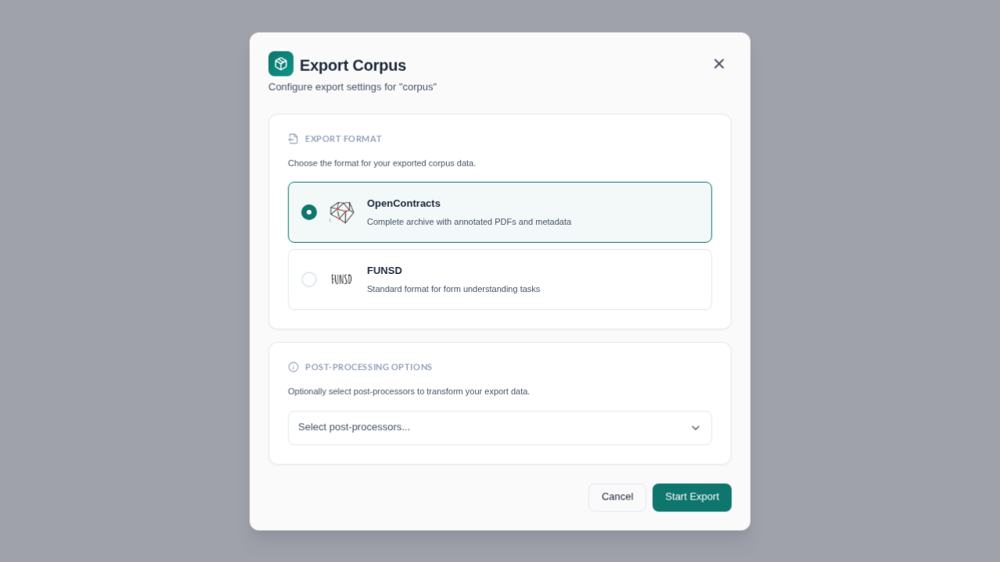
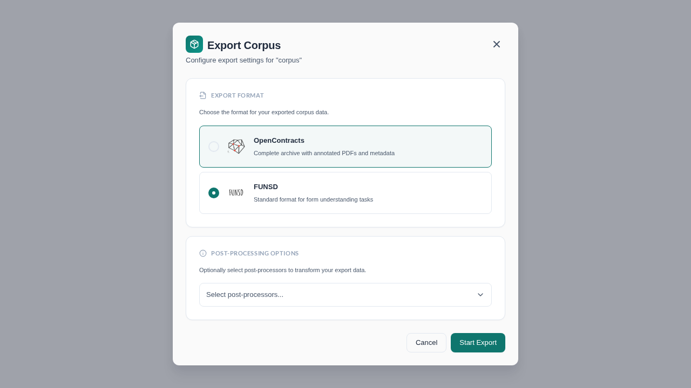
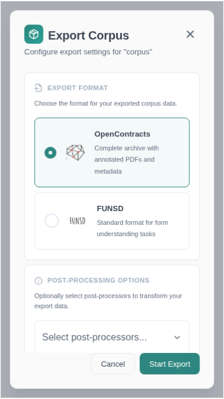

# Export / Import Functionality

## Exports

OpenContracts supports both exporting and importing corpuses. This functionality is disabled on the public
demo as it can be bandwidth intensive. If you want to experiment with these features on your own, you'll see
the export action when you right-click on a corpus:

### Running an Export

1. **Open the export modal.** Right-click on a corpus in the corpus list and select **Export** from the context menu. This opens the export configuration modal.

   

2. **Choose an export format.** Two formats are available:
   - **OpenContracts** (default) — Produces a complete archive containing annotated PDFs, PAWLs layers, and full metadata. This is the recommended format for backing up or transferring corpuses between OpenContracts instances.
   - **FUNSD** — Produces output in the FUNSD format, which is commonly used for form understanding and OCR research tasks.

   

3. **Select post-processors (optional).** If post-processing pipelines are available on your instance, you can select one or more from the dropdown. Post-processors with configurable settings will display a form where you can set parameters.

4. **Start the export.** Click **Start Export** to begin. You will see a confirmation toast. The export runs asynchronously on the server.

5. **Download the result.** You can access your exports from the user dropdown menu in the top right corner of the screen. Once your export is complete, you can download a zip containing all the documents, their PAWLs layers, and the corpus data you created — including all annotations.

### Mobile Support

The export modal is fully responsive and works on mobile devices with a bottom-sheet layout.

## Imports

If you've enabled corpus imports (see the **frontend** env file for the boolean toggle to do this — it's
`REACT_APP_ALLOW_IMPORTS`), you'll see an import action when you click the action button on the corpus page.

# Export Format Reference

For the complete export format specification (V1 and V2), including all field
definitions, referential integrity rules, and examples, see the
[Corpus Export Format Specification](../../architecture/corpus-export-format-spec.md).

For a summary of the export/import workflow and what each format version
includes, see [Corpus Export and Import](../../upload_methods/corpus_export_import.md).
